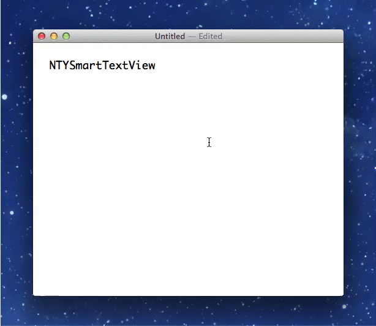

# NTYSmartTextView

[](http://cocoadocs.org/docsets/NTYSmartTextView)
[](http://cocoadocs.org/docsets/NTYSmartTextView)



## Features

- Smart indent: Keep the width of indent when breaking line.
- Soft tab: Input spaces instead of tabs by entering TAB key.
- Auto pair completion: Automatically complete closing braces and quotes.

## Installation

NTYSmartTextView is available through [CocoaPods](http://cocoapods.org), to install
it simply add the following line to your Podfile:

```rb
platform :osx
pod "NTYSmartTextView"
```

## Usage

At Xib, set the custom view of a text view to `NTYSmartTextView`. By default, above features is enabled. If you want to change th default configurations, change properties as follows.

### Smart indent

```objective-c
self.textView.smartIndentEnabled = NO;
```

### Soft tab

```objective-c
self.textView.softTabEnabled = NO;

// You also can change the width of soft tab from 4.
self.textView.tabWidth = 2;
```

### Auto pair completion

```objective-c
self.textView.autoPairCompletionEnabled = NO;
```
